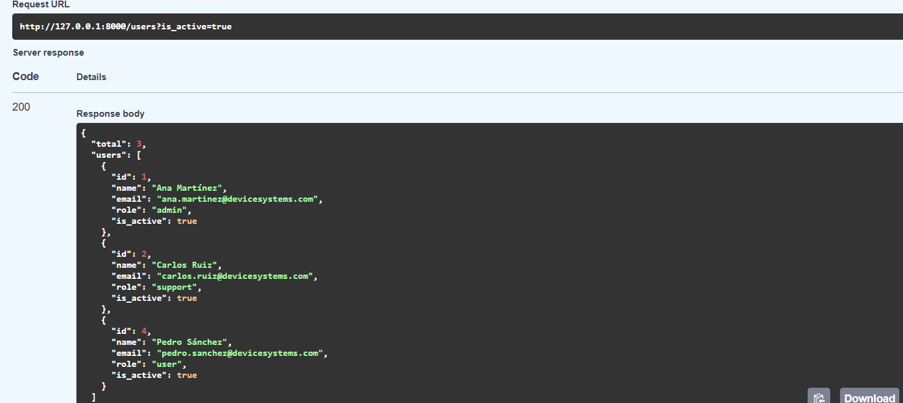
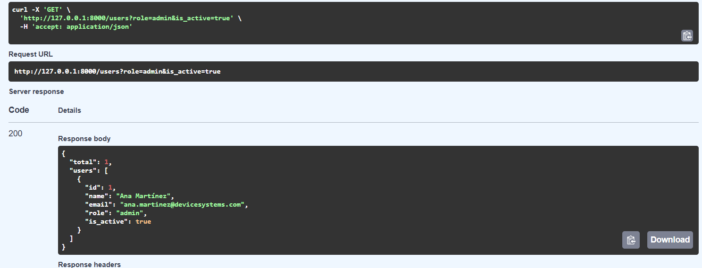
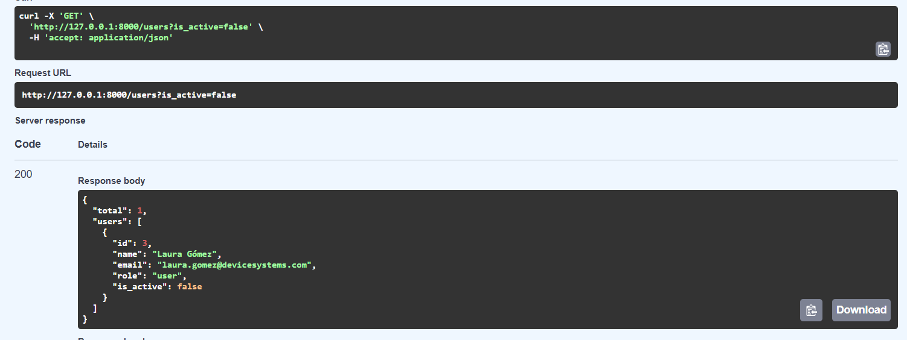
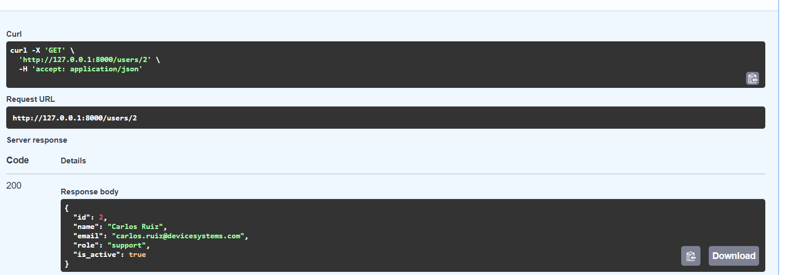
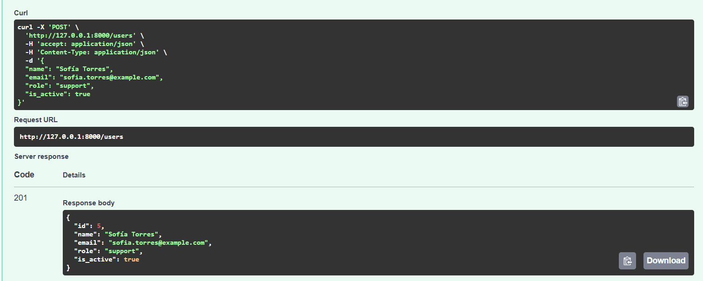

# 🖥️ device_systems — API REST de Gestión de Usuarios

API REST construida con **FastAPI** y **Pydantic v2** para administrar usuarios del sistema `device_systems`.

---

## 📋 Descripción

`device_systems` es una API backend que expone endpoints para **listar, consultar, filtrar y registrar usuarios**. Implementa:

- Validación de datos con **Pydantic v2**
- Parámetros de ruta (**Path Parameters**)
- Parámetros de consulta (**Query Parameters**)
- **Response Models** para estandarizar respuestas
- **Cabeceras HTTP personalizadas**
- Documentación automática con **Swagger UI** y **ReDoc**

---

## 🗂️ Estructura del proyecto

```
device_systems/
├── app/
│   ├── main.py               # Punto de entrada de la aplicación
│   ├── schemas/
│   │   └── user_schema.py    # Modelos Pydantic (entrada y salida)
│   └── routes/
│       └── user_routes.py    # Endpoints del recurso usuarios
├── requirements.txt          # Dependencias del proyecto
└── README.md
```

---

## ⚙️ Instalación y configuración

### Requisitos previos

| Herramienta | Versión recomendada | Notas |
|-------------|---------------------|-------|
| Python      | **3.12.x**          | Versión estable recomendada. Python 3.14 no es compatible con las dependencias actuales. |
| pip         | 25.x o superior     | Actualizar con `python.exe -m pip install --upgrade pip` |
| Git Bash    | Cualquiera          | Terminal recomendada en Windows |

> ⚠️ **Importante:** usar Python 3.12. Para instalar: https://www.python.org/downloads/release/python-31211/
> Al instalar, marcar ✅ **"Add python.exe to PATH"**

---

### 1. Clonar / descargar el proyecto

```bash
git clone <url-del-repo>
cd device_systems_
```

### 2. Crear entorno virtual con Python 3.12

```bash
py -3.12 -m venv venv
```

### 3. Activar el entorno virtual

```bash
# Git Bash en Windows:
source venv/Scripts/activate

# macOS / Linux:
source venv/bin/activate
```

Verás `(venv)` al inicio de la línea cuando esté activo.

### 4. Instalar dependencias

```bash
pip install -r requirements.txt
```

**requirements.txt:**
```
fastapi==0.115.5
uvicorn[standard]==0.32.1
pydantic[email]==2.10.3
```

### 5. Ejecutar el servidor

```bash
uvicorn app.main:app --reload
```

Salida esperada:
```
INFO:     Will watch for changes in these directories: [...]
INFO:     Uvicorn running on http://127.0.0.1:8000 (Press CTRL+C to quit)
INFO:     Started reloader process [xxxx] using WatchFiles
INFO:     Started server process [xxxx]
INFO:     Waiting for application startup.
INFO:     Application startup complete.
```

---

## 🌐 Documentación interactiva

Con el servidor corriendo, abre en el navegador:

| Interfaz   | URL                           |
|------------|-------------------------------|
| Swagger UI | http://127.0.0.1:8000/docs    |
| ReDoc      | http://127.0.0.1:8000/redoc   |
| Raíz       | http://127.0.0.1:8000/        |

---

## 📌 Tabla de Endpoints

| Método | Endpoint             | Descripción                          | Parámetros                            |
|--------|----------------------|--------------------------------------|---------------------------------------|
| GET    | `/`                  | Bienvenida y estado de la API        | —                                     |
| GET    | `/users`             | Listar todos los usuarios            | —                                     |
| GET    | `/users`             | Filtrar usuarios por rol             | `?role=admin` \| `support` \| `user`  |
| GET    | `/users`             | Filtrar usuarios por estado          | `?is_active=true` \| `false`          |
| GET    | `/users/{user_id}`   | Obtener un usuario por su ID         | Path: `user_id` (entero ≥ 1)         |
| POST   | `/users`             | Crear un nuevo usuario               | Body JSON                             |

---

## 📦 Modelo de Usuario

### Entrada (`UserCreate`)

```json
{
  "name": "Juan Pérez",
  "email": "juan.perez@example.com",
  "role": "user",
  "is_active": true
}
```

| Campo       | Tipo    | Obligatorio        | Validaciones                        |
|-------------|---------|--------------------|-------------------------------------|
| `name`      | string  | ✅                  | Mínimo 3 caracteres, no vacío       |
| `email`     | string  | ✅                  | Formato de correo válido            |
| `role`      | string  | ✅                  | Valores: `admin`, `support`, `user` |
| `is_active` | boolean | ❌ (default `true`) | `true` o `false`                    |

### Salida (`UserResponse`)

```json
{
  "id": 5,
  "name": "Juan Pérez",
  "email": "juan.perez@example.com",
  "role": "user",
  "is_active": true
}
```

---

## 🔍 Ejemplos de peticiones

### GET — Listar todos los usuarios: 

```http
GET http://127.0.0.1:8000/users
```

**Respuesta 200:**
```json
{
  "total": 4,
  "users": [
    { "id": 1, "name": "Ana Martínez",  "email": "ana.martinez@devicesystems.com",  "role": "admin",   "is_active": true },
    { "id": 2, "name": "Carlos Ruiz",   "email": "carlos.ruiz@devicesystems.com",   "role": "support", "is_active": true },
    { "id": 3, "name": "Laura Gómez",   "email": "laura.gomez@devicesystems.com",   "role": "user",    "is_active": false },
    { "id": 4, "name": "Pedro Sánchez", "email": "pedro.sanchez@devicesystems.com", "role": "user",    "is_active": true }
  ]
}
```

---

### GET — Filtrar por rol: 

```http
GET http://127.0.0.1:8000/users?role=admin
```

**Respuesta 200:**
```json
{
  "total": 1,
  "users": [
    { "id": 1, "name": "Ana Martínez", "email": "ana.martinez@devicesystems.com", "role": "admin", "is_active": true }
  ]
}
```

---

### GET — Filtrar por estado inactivo: 

```http
GET http://127.0.0.1:8000/users?is_active=false
```

**Respuesta 200:**
```json
{
  "total": 1,
  "users": [
    { "id": 3, "name": "Laura Gómez", "email": "laura.gomez@devicesystems.com", "role": "user", "is_active": false }
  ]
}
```

---

### GET — Obtener usuario por ID: 

```http
GET http://127.0.0.1:8000/users/2
```

**Respuesta 200:**
```json
{
  "id": 2,
  "name": "Carlos Ruiz",
  "email": "carlos.ruiz@devicesystems.com",
  "role": "support",
  "is_active": true
}
```

**Respuesta 404:**
```json
{
  "detail": "Usuario con id=99 no encontrado."
}
```

---

### POST — Crear usuario: 

```http
POST http://127.0.0.1:8000/users
Content-Type: application/json

{
  "name": "Sofía Torres",
  "email": "sofia.torres@example.com",
  "role": "support",
  "is_active": true
}
```

**Respuesta 201:**
```json
{
  "id": 5,
  "name": "Sofía Torres",
  "email": "sofia.torres@example.com",
  "role": "support",
  "is_active": true
}
```

**Respuesta 409 — correo duplicado:**
```json
{
  "detail": "El correo 'sofia.torres@example.com' ya está registrado."
}
```

**Respuesta 422 — validación fallida:**
```json
{
  "detail": [
    {
      "type": "string_too_short",
      "loc": ["body", "name"],
      "msg": "String should have at least 3 characters",
      "input": "ab",
      "ctx": { "min_length": 3 }
    }
  ]
}
```

---

## 🔧 Cabeceras HTTP personalizadas

Todos los endpoints retornan:

| Cabecera        | Valor            |
|-----------------|------------------|
| `X-App-Name`    | `device_systems` |
| `X-API-Version` | `1.0`            |

---

## 🛠️ Tecnologías utilizadas

| Tecnología | Versión  | Uso                   |
|------------|----------|-----------------------|
| Python     | 3.12.x   | Lenguaje base         |
| FastAPI    | 0.115.5  | Framework web         |
| Pydantic   | 2.10.3   | Validación de datos   |
| Uvicorn    | 0.32.1   | Servidor ASGI         |

---

## 👤 Autor: Vanessa Ocampo